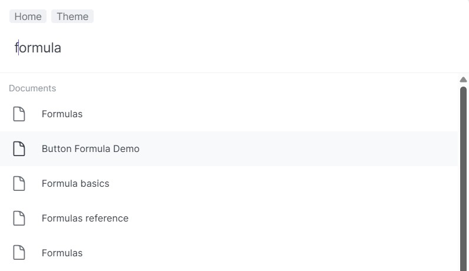

In Fundamento we provide a lot of useful key combinations as a shortcuts, however also for 
your convenience when it comes to e.g. search the Organization for documents, tables.

Try to use ctrl+k on your keybord and plenty of possibilities will appear:

In the field: "Type command or search" you are able to search the Organization you're logged
in at the moment and find all the items related to your search

"Go to Dashboard" feature or just ctrl+h combination will lead you to a list of Spaces in
your Organizations, in that way you can easily jump from one Space to another.

Thanks to using ctrl+k combination Fundamento gives you also a couple of handy shorcuts in
our tool as: View all Organizations, View all Spaces, View all Teams.

You can also go in just one click to your Account Settings oraz change the theme from light
to dark (or from dark to light)
